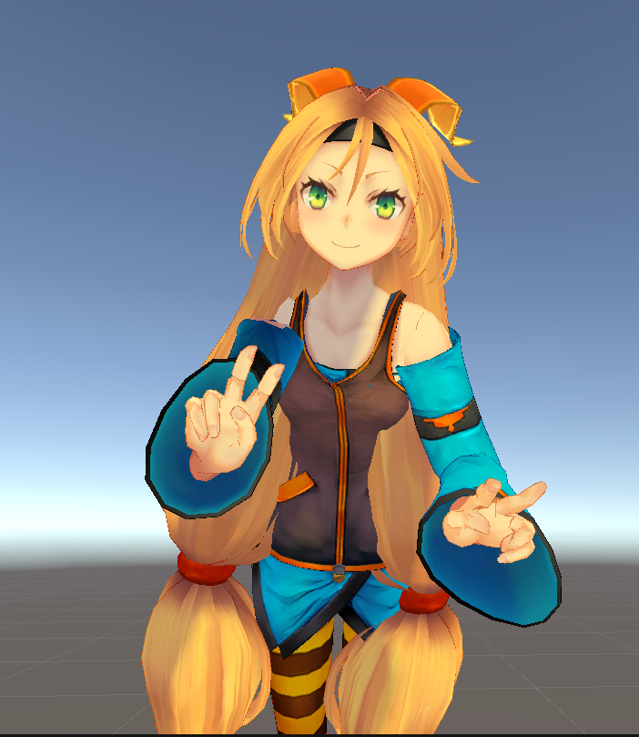

# Real-Time Pose Tracking and Avatar Animation

## Table of Contents

- [Overview](#overview)
- [Features](#features)
- [Architecture](#architecture)
- [Installation](#installation)
- [Usage](#usage)
- [Configuration](#configuration)
- [Troubleshooting](#troubleshooting)
- [How to use](#How to use)

## Overview

This project enables real-time pose tracking using MediaPipe and animates a 3D avatar in [Unity](https://unity.com/) based on the captured pose data. The system captures body movements via a webcam, processes the data with Python, and sends the pose information to Unity using UDP for smooth and responsive avatar animations.

## Features

- **Real-Time Pose Detection**: Utilizes MediaPipe's advanced pose estimation to detect and track body landmarks in real-time.
- **Seamless Integration with Unity**: Sends processed pose data to Unity via UDP, enabling smooth avatar animations.
- **Customizable Avatar**: Supports a customizable avatar with a hierarchical bone structure for accurate movement replication.

## Architecture

The system comprises two main components:

1. **Python Script**: Captures video from the webcam, processes pose data using MediaPipe, and sends the data to Unity via UDP.
2. **Unity Project**: Receives pose data, maps it to the avatar's bone structure, and updates the avatar's pose in real-time.

## Installation

### Prerequisites

- **Python 3.7+**
- **Unity 2021.3 LTS or later**
- **Webcam** for pose detection

### How to use

```bash
git clone https://github.com/skill-diver/Unity_MediaPipe_Action_Tracking.git
```

Import Unity directory in Unity.

Navigate to the Python directory and start the tracking script:

```bash
cd Python
python main.py
```
Run the Unity Scene
Open the scene in Unity.
Click the Play button in Unity to start the simulation.
The character in Unity should now move in real-time, mirroring your movements captured by the webcam.


